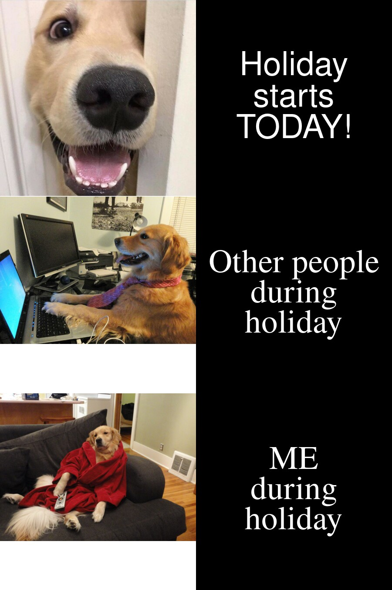

# Welcome 🥳

Hello! This is my STATS220 website 🧸

## About me 👀

- I am a Chinese girl and I'm now reading for a [data science degree](https://www.auckland.ac.nz/en/study/study-options/find-a-study-option/data-science.html) 💖 at the [University of Auckland](https://www.auckland.ac.nz/en.html).

- I **LOVE** dogs 🥰 (especially the golden retriever)

- I have a series of interests, such as 
     1. *EATING EATING EATING* 😋
     2. keeping a diary
     3. reading 📚 & watching documentaries 🎞
     4. learning different languages 
     5. playing the piano 🎹 & listening to the music 🎧
     6. 🏸🚴🏻🏊🏻‍♀️⛸🎡🎬...... 


## I learned to make my own meme 😎

The meme below was made by me using the R package [{magick}](https://cran.r-project.org/web/packages/magick/vignettes/intro.html).



### More about my meme

1. Since I really love golden retriever, I think it is awesome to use the pictures of golden retriever to be my first meme 😉
2. I found the meme I liked and make the caption for each picture by myself 📝
3. Use the `R` code below to creat my own meme ✌🏻

Here are the codes:

```r
library(magick)

exciting_dog <- image_read("https://www.meme-arsenal.com/memes/3628e4f08adb608f0fb992baf7030062.jpg")%>%
  image_scale(450)

studing_dog <- image_read("https://uploads.dailydot.com/a6a/ed/775fb3fce3a1a902.jpg?auto=compress&fm=pjpg&ixlib=php-3.3.0")%>%
  image_scale(450)

resting_dog <- image_read("https://uploads.dailydot.com/61b/68/711c2808700a1bdd.jpg?auto=compress&fm=pjpg&ixlib=php-3.3.0")%>%
  image_scale(450)


holiday_text <- image_blank(width = 450,
                            height = 450,
                            color = "#000000") %>%
  image_annotate(text = "Holiday\nstarts\nTODAY!",
                 color = "#FFFFFF",
                 size = 75,
                 font = "Impact",
                 gravity = "center")

others_text <- image_blank(width = 450,
                           height = 450,
                           color = "#000000") %>%
  image_annotate(text = "Other people\nduring\nholiday",
                 color = "#FFFFFF",
                 size = 75,
                 font = "Times",
                 gravity = "center")

me_text <- image_blank(width = 450,
                       height = 450,
                       color = "#000000") %>%
  image_annotate(text = "ME\nduring\nholiday",
                 color = "#FFFFFF",
                 size = 75,
                 font = "Times",
                 gravity = "center")


first_row <- c(exciting_dog, holiday_text) %>%
  image_append()

second_row <- c(studing_dog, others_text) %>%
  image_append()

final_row <- c(resting_dog, me_text) %>%
  image_append()

my_meme <- c(first_row, second_row, final_row) %>%
  image_append(stack = TRUE)
  
```
